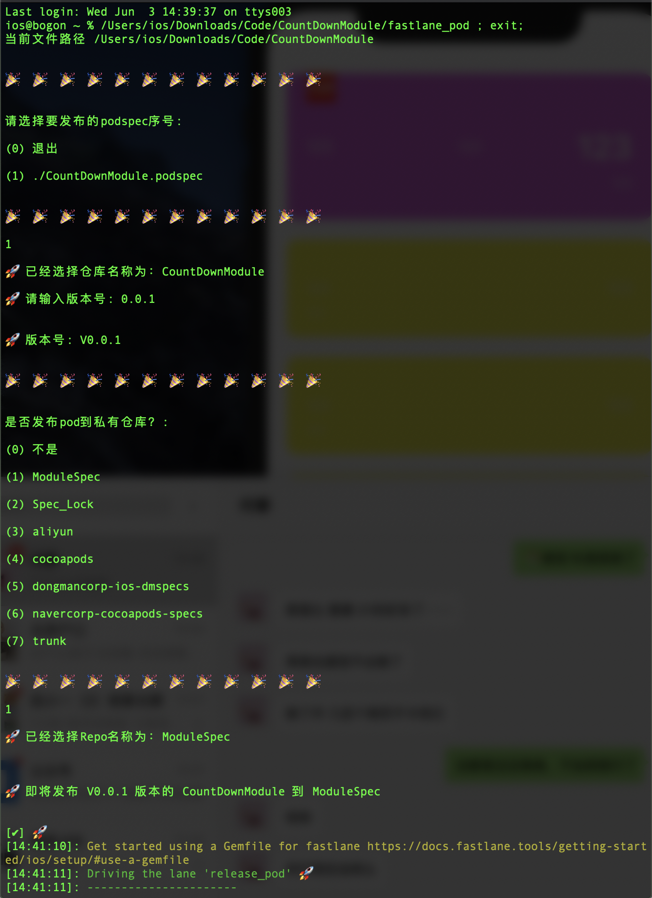

# IPAAutoBuild 依赖Fastlane进行打包
### IPA打包发布
请先安装fastlane
```
sudo gem install fastlane
```

**使用方法**
1. 把**ipa_build**文件夹拖放到你的工程根目录下边（文件夹与xcworkspace文件同级）
2. 工程配置Automatically manage signing 自动签名
3. xcode8以后打包需要**ExportOptions.plist**文件，也放在工程根目录(可以直接用archive导出来的那个ExportOptions.plist)具体请参考ExportOptions.plist文件
4. 双击**Debug_ipa**文件即可导出到桌面一个ipa的Debug包，同理**Release_ipa**是Release包
5. 双击**APP_Store**会进行打包上传App Store，过程中会提示输入APPID密码，需要搭配另外一个**APPStore.plist**(可以直接用archive导出来的那个ExportOptions.plist，改一下名称)具体请见参开文件
6. 可以根据自己的需要添加命令行发布到fir或者其他分发平台例子如下，右键打开方式选文本编辑取消相应的代码注释就可以

上传到蒲公英
```objc
//判断文件是否存在
if [ "$output_ipa_path" != "" ];then

echo " 🎉  🎉  🎉  🎉  🎉  🎉  开始上传蒲公英! 🎉  🎉  🎉  🎉  🎉  🎉 "

curl -F "file=@$export_path_ipa" -F "uKey=你自己的key" -F "_api_key=你自己的key" https://qiniu-storage.pgyer.com/apiv1/app/upload

echo " 🎉  🎉  🎉  🎉  🎉  🎉  蒲公英上传完成! 🎉  🎉  🎉  🎉  🎉  🎉  "

```

上传到Fir.im
```

echo " 🎉  🎉  🎉  🎉  🎉  🎉  开始上传Fir! 🎉  🎉  🎉  🎉  🎉  🎉 "

fir login "你自己的key"
fir me
fir publish $export_path_ipa
 
echo "🎉  🎉  🎉  🎉  🎉  🎉  Fir上传完成! 🎉  🎉  🎉  🎉  🎉  🎉 "
fi
```

# Jenkins打包
直接添加运行脚本复制粘贴命令即可
```
security unlock-keychain -p 1234 ~/Library/Keychains/login.keychain 

fastlane gym --export_method ad-hoc --output_name APPscheme名字 --scheme APPscheme名字 --clean --configuration Debug --output_directory ./ --export_options ./ExportOptions.plist  --export_xcargs -allowProvisioningUpdates

```

#  Cocoapods打包发布
### fastlane_pod
**fastlane_pod** 用于cocoapods打包发布，包括私有、公有。完全可视化操作，双击即可执行命令
1. fastlane_pod 追踪当前目录下的podspec文件并提示进行选择
2. 提示输入即将发布的版本号
3. 查找当前电脑的Repos仓库目录进行选择（发私有仓库还是cocoapods仓库）
4. 调用fastlane文件夹下的fastlane文件进行传参打包

参考用例：


请使用fastlane文件夹下的fastlane文件

# 企业微信发送消息

* 以下为打包上传完成后调用企业微信开放平台接口获取当前企业微信的token，并且发送消息

* 获取当前企业微信的token，需要安装JQ脚本用于解析json

```
curl -o token.txt -s https://qyapi.weixin.qq.com/cgi-bin/gettoken?corpid=XXXXXXXXXXXXX\&corpsecret=SSSSSSSSSSSS
token=$(cat token.txt |jq -r '.access_token')
echo "这里是一个文件的内容 $token"
```
* 获取当前APP信息

```
App_Name=`find . -name *.xcodeproj | awk -F "[/.]" '{print $(NF-1)}'`

echo "输出App_Name $App_Name"
Workspace_Path="${project_path}/${App_Name}.xcworkspace"
Xcodeproj_Path="${project_path}/${App_Name}.xcodeproj"
# project.pbxproj文件路径
Pbxproj_Path="${Xcodeproj_Path}/project.pbxproj"
echo "输出Pbxproj_Path $Pbxproj_Path"

current_data="$(date +%Y-%m-%d_%H:%M:%S)"

# Pbxproj_Path指向 project.pbxproj 文件路径
configuration=$(grep -i "MARKETING_VERSION =" ${Pbxproj_Path})

Array=($(echo $configuration))
# project.pbxproj 中存在多行PRODUCT_BUNDLE_IDENTIFIER信息，从后往前读取
MARKETING_VERSION=${Array[5]}
if [ ! -n $MARKETING_VERSION ]
then
    MARKETING_VERSION=${Array[3]}
fi
```
* 获取当前时间

```
current_data="$(date +%Y%m%d_%H%M%S)"
```
* Curl命令 POST消息 toparty为需要接收当前消息的小组ID（例如测试组，产品组，UI组。。。。。等等，ID自行获取企业微信有接口，拿到token后postman即可）

```
curl -H "Content-Type: application/json" -X POST -d '{"touser" : "","toparty" : "54|3|38|45|47|48|51|53|55|56|57","totag" : "","msgtype" : "text","agentid" : 1000003,"text" : {"content" : "XXXXAPP测试包'$bundle_version'版本已于'$current_data'打包成功,下载地址<a href=\"https://www.pgyer.com/iktjb\">点击跳转蒲公英下载</a>。"},"safe":0}' https://qyapi.weixin.qq.com/cgi-bin/message/send?access_token=$token

//图文样式
# curl -H "Content-Type: application/json" -X POST -d '{"touser" : "","toparty" : "你企业微信分组id","totag" : "","msgtype" : "text","agentid" : 1000003,"text" : {"content" : "Debug测试包'$MARKETING_VERSION'版本已于'$current_data'打包成功,下载地址<a href=\"https://www.pgyer.com/xxx\">点击跳转蒲公英下载</a>。"},"safe":0}' https://qyapi.weixin.qq.com/cgi-bin/message/send?access_token=$token

```

同样的钉钉平台也可以根据开放平台接口通过token进行发送消息
